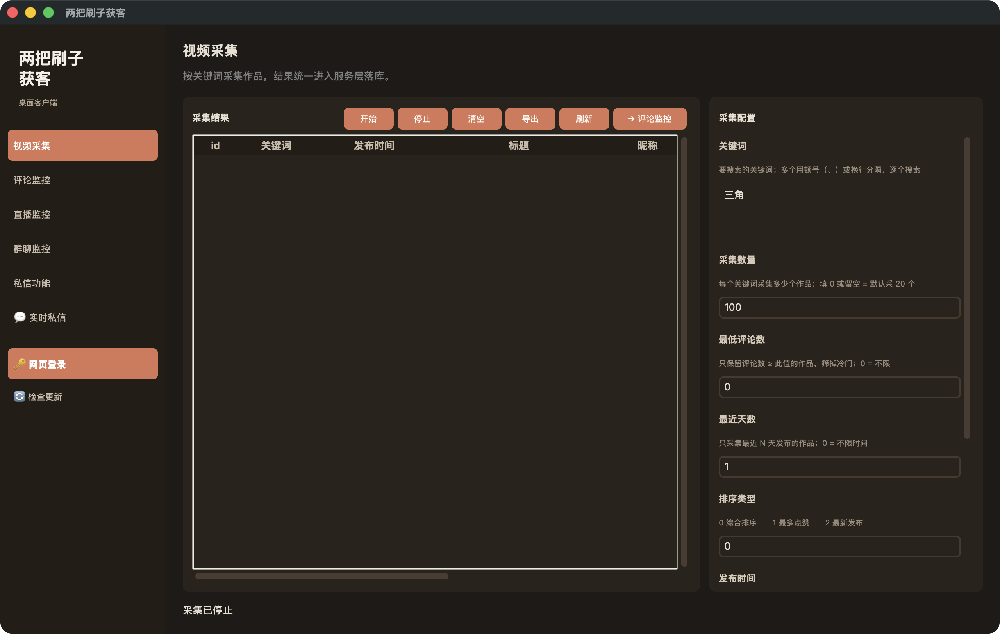
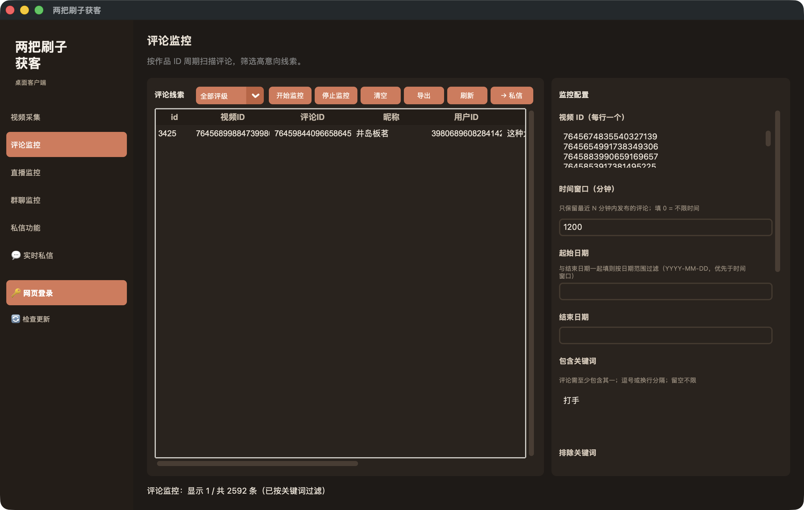
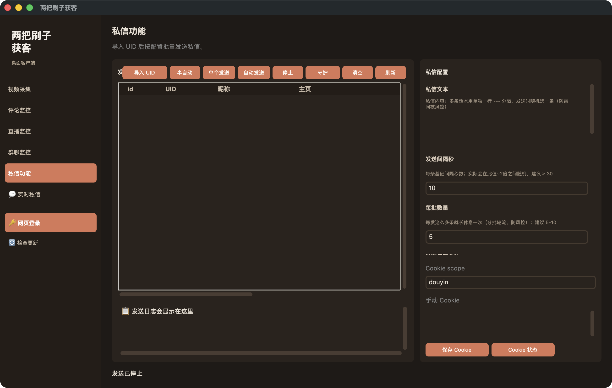
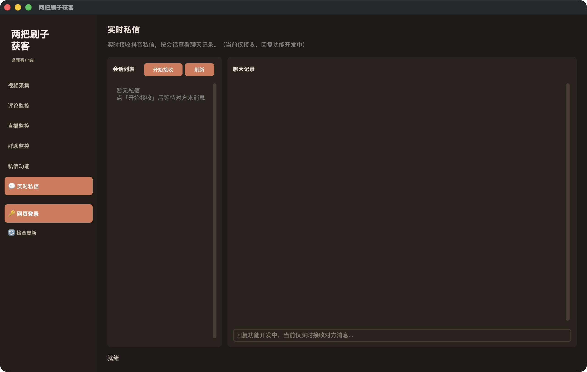

<p align="center">
  <a href="https://github.com/cv-cat/DouYin_Spider" target="_blank">
    
  </a>
</p>

<div align="center">
  
  
  
  
</div>

# 🎶 两把刷子获客 · 桌面客户端版

> **本项目 fork 自原作者 [cv-cat / DouYin_Spider](https://github.com/cv-cat/DouYin_Spider)。**
> 抖音数据采集、请求签名（a_bogus 等）、直播间监听、私信收发等**全部核心能力均来自原作者 cv-cat**，在此致谢并署名。
> 本分支只做了一件事：**在原项目之上封装了一个桌面客户端（GUI）**，并补齐打包分发与一些体验优化，方便不懂命令行的人直接双击使用。

---

## ⚠️ 免责声明（请务必阅读）

- 本项目（含本分支的全部改动）**仅供个人学习、技术研究与交流使用，不用于任何商业用途**。
- 本分支作者只是出于**学习目的**，在原项目基础上练习「把命令行工具封装成桌面客户端」，并非商用产品。
- **严禁**用于发布不良/违法信息、批量骚扰、灰黑产或任何违反抖音平台规则与法律法规的行为。
- 使用本项目所产生的一切后果，由使用者自行承担，与原作者 cv-cat 及本分支作者均无关。
- 本项目不对数据准确性、可用性、账号安全做任何担保；自动化操作存在账号风险，请谨慎、小批量使用。
- 如有侵权或不妥，请联系删除。

---

## 🆕 本分支新增了什么（桌面客户端）

在原命令行 / Web 项目之上，新增了一个基于 **CustomTkinter** 的桌面客户端（暖色 Claude 主题），把原有能力做成「点点点」就能用的界面：

- 🖥️ **桌面 GUI**：视频采集、评论监控、直播监控、群聊监控、私信功能，统一在一个窗口里
- 🔗 **采集→监控联动**：采集到的视频可一键转入评论监控
- 🧭 **评论线索面板**：发布时间排序、包含/排除关键词实时过滤、**评级（S/A/B/C）过滤**（仅过滤列表显示，不影响后台监控）
- 💬 **实时私信（新功能）**：基于 WebSocket 实时接收抖音私信，左侧会话列表 + 右侧聊天气泡，按会话查看，自动反查昵称（当前仅接收）
- 🔑 **网页登录**：内置浏览器走 JS 风控扫码登录，自动保存 Cookie
- 🛡️ **私信防风控**：话术随机、间隔随机、分批轮流、每日上限、活跃时段、连续失败熔断（仅供学习了解风控机制）
- 📦 **一键打包分发**：GitHub Actions 自动构建 **Windows / macOS** 双端发行包，**内置 chromium 浏览器内核**，用户双击即用——无需安装 Python / Node / 浏览器
- 🔄 **检查更新**、窗口大小记忆、关窗即彻底退出等体验优化

### 📸 界面预览

| 视频采集 | 评论监控 |
|---|---|
|  |  |

| 私信功能 | 💬 实时私信 |
|---|---|
|  |  |

---

## 🚀 下载即用（推荐）

无需任何环境，下载解压双击即可（首启已内置浏览器内核，无需联网下载）：

- **Windows**：[liangbashuazi-windows.zip](https://github.com/371066607/DouYin_Spider/releases/download/windows/liangbashuazi-windows.zip) → 解压双击 `liangbashuazi.exe`
- **macOS（Apple Silicon）**：[liangbashuazi-macos.zip](https://github.com/371066607/DouYin_Spider/releases/download/macos/liangbashuazi-macos.zip) → 解压双击 `liangbashuazi.app`
  - 首次打开若提示「无法验证开发者」，**右键 App 选「打开」**，或终端执行 `xattr -cr liangbashuazi.app`

> 全部发行包均由 [GitHub Actions](./.github/workflows) 自动构建，并在对应平台跑过冒烟自检（导入 + 建服务 + 签名 + chromium 定位）后才发布。

## 🧑‍💻 源码运行（开发者）

需要 Python 3.11+ 与 Node.js 18+：

```bash
pip install -r requirements.txt
npm install --ignore-scripts        # 跳过 canvas 原生编译（签名不需要它）
python -m playwright install chromium
python -m desktop.client            # 启动桌面客户端
```

原项目的其它运行方式（CLI / Web UI / 直播监听等）见下文「原项目能力」。

---

## 🧱 原项目能力（来自 cv-cat / DouYin_Spider）

以下能力均由原作者实现，本分支仅做界面封装，详情请见 **[原仓库](https://github.com/cv-cat/DouYin_Spider)**：

- **多维度数据采集**：用户主页 / 作品详情 / 评论（含多级回复）/ 搜索 / 关注粉丝 / 推荐流等
- **直播间实时监听**：弹幕 / 礼物 / 进场 / 关注 / 点赞 / 房间热度，支持发弹幕、点赞
- **抖音私信收发**：基于 WebSocket 的私信接收与发送
- **请求签名**：通过 Node.js 还原平台侧指纹（a_bogus / 直播签名等）

## 🙏 致谢

- 核心爬虫、签名、直播、私信等全部底层能力，归功于原作者 **[cv-cat](https://github.com/cv-cat)**（[DouYin_Spider](https://github.com/cv-cat/DouYin_Spider)）。
- 如果原项目对你有帮助，请去给 **原作者** 点个 ⭐ 并支持原作者。

## 📄 出处与许可

本分支为 [cv-cat/DouYin_Spider](https://github.com/cv-cat/DouYin_Spider) 的学习用 fork，遵循原项目的开源与使用条款。仅供学习研究，请勿商用。
